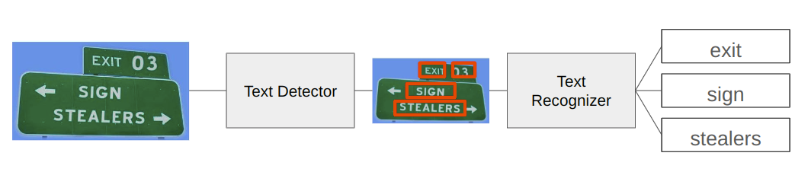

# OCR in the Wild: Cloud and Edge Implementations



## Overview

This repository demonstrates implementations of Optical Character Recognition (OCR) for text in the wild, designed for both cloud and edge deployment scenarios. Our goal is to provide flexible, efficient OCR solutions that can be adapted to various use cases and hardware constraints.

## OCR Process

Our OCR system employs a two-step process for accurate text recognition in natural scenes:

1. **Text Detection**: This step identifies and locates all instances of text within an image. It produces bounding boxes around detected text areas.

2. **Text Recognition**: After detection, the identified text regions are cropped and batched. These batches are then passed through a recognition model that converts the image of text into machine-readable characters.

This two-step approach allows for:
- Efficient processing of images with multiple text instances
- Improved accuracy by focusing the recognition model on specific text regions
- Flexibility in handling various text orientations and layouts

Both our cloud and edge implementations follow this two-model approach, with optimizations specific to their deployment environments.

## Repository Structure

This repository is divided into two main sections:

1. **Cloud OCR**: A scalable, high-performance OCR system designed for cloud deployment.
2. **Edge OCR**: A lightweight, efficient OCR model suitable for deployment on edge devices.

## Cloud OCR Implementation

Our cloud-based OCR system leverages pre-trained models from PaddlePaddleOCR, converted to ONNX format for improved performance and compatibility. It uses Triton Inference Server for efficient model serving and exposes its functionality through a Flask API.

Key features of the cloud implementation:

- Uses state-of-the-art PaddlePaddleOCR models for text detection and recognition
- ONNX-format models for cross-platform compatibility
- Triton Inference Server for scalable model serving
- Flask API for easy integration with various applications
- Designed for deployment in cloud environments
- Efficient batching of detected text regions for recognition

For more details, see the [Cloud OCR README](./cloud/README.md).

## Edge OCR Implementation

Our edge-based OCR system is designed to run efficiently on resource-constrained devices. It uses custom, lightweight model architectures for both detection and recognition that prioritize speed and low memory footprint without significantly compromising accuracy.

Key features of the edge implementation:

- Custom CNN architectures optimized for edge devices
- Uses only convolutional operations for wide hardware compatibility
- Text detection model designed for quick region proposals
- Text recognition model trained with CTC loss for efficient sequence learning
- Configurable for different input sizes and character sets
- Easily convertible to ONNX and TensorRT for further optimization
- Optimized pipeline for efficient processing of detected text regions

For more details, see the [Edge OCR README](./edge/README.md).

## Comparison

| Feature                | Cloud OCR                                  | Edge OCR                                |
|------------------------|--------------------------------------------|-----------------------------------------|
| Deployment Target      | High-performance cloud servers             | Resource-constrained edge devices       |
| Model Source           | Pre-trained PaddlePaddleOCR                | Custom-trained lightweight models       |
| Model Format           | ONNX (convertible to TensorRT)             | PyTorch (convertible to ONNX/TensorRT)  |
| Text Detection         | High-accuracy, GPU-optimized               | Lightweight, speed-optimized            |
| Text Recognition       | Advanced LSTM-based model                  | Compact CNN with CTC loss               |
| Inference Server       | Triton Inference Server                    | Direct inference or lightweight server  |
| API                    | Flask                                      | Optional lightweight API                |
| Batching               | Efficient GPU batching                     | Memory-conscious batching               |
| Primary Advantages     | High accuracy, scalability                 | Low latency, minimal resource usage     |

## Getting Started

To get started with either the cloud or edge implementation:

1. Clone this repository:
   ```
   git clone https://github.com/your-username/ocr-implementations.git
   ```
2. Navigate to either the `cloud` or `edge` directory:
   ```
   cd ocr-implementations/cloud
   # or
   cd ocr-implementations/edge
   ```
3. Follow the setup instructions in the respective README files.
